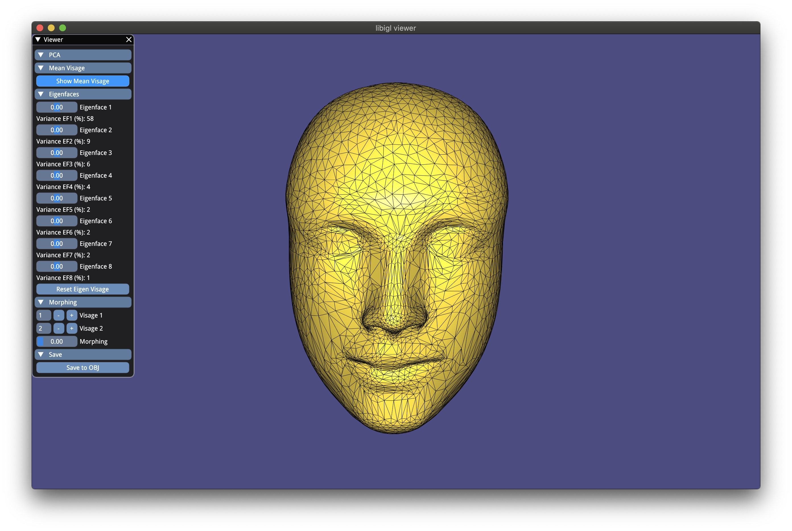

# smgp-3D-face-modeling-and-learning

## PCA Interpolation and Visualization

### Variables to (eventually) change in `main.py`.
- `load_folder_name`: path to folder name containing the meshes to be loaded - in our case, the `warped_out_small` downloadable from the main Readme.md;
- `store_file_name`: path to file name where new OBJ file needs to be saved;

### Compiling

```
mkdir build; cd build
cmake -DCMAKE_BUILD_TYPE=Release ../
make
```

### Running
```
./assignment6_PCA
```

### Features

* Show Mean Visage

The mean visage is computed by taking the row-wise mean of the matrix containing visages, where each column of the matrix represents a visage.



* Apply Different Weights to Different Eigenfaces

To retrieve the eigenfaces (or eigenvectors) and the eigenvalues, the covariance matrix is computed and an eigen solver is used to perform eigen decomposition.

Eigen decomposition is performed using the Spectra library, in order to achieve real-time performance over the full dataset of 112 meshes.

The shown visage is the result of the mean_visage plus the sum of each eigenfaces multiplied by the relative weight set with the relative slider.


* Reset Eigenfaces and Sliders

Sliders are reset to 0, and the mean visage is shown.


* Apply Morphing between two meshes

The weights on morphing are computed by taking for each visage the transpose of its  transposed difference from the mean visage, multiplied by the eigenvectors.

To get the morphing out, the morphing parameters are the results of the wi for the first chosen visage plus the value set by the morphing slider multiplied by the difference between the second and first visage wi.

(See Assignment slides as reference)


