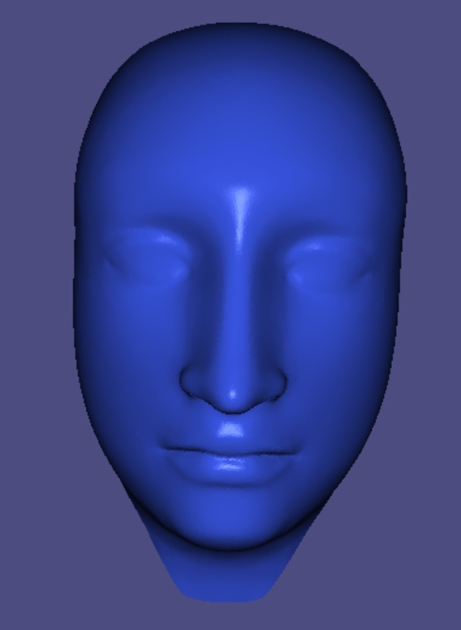
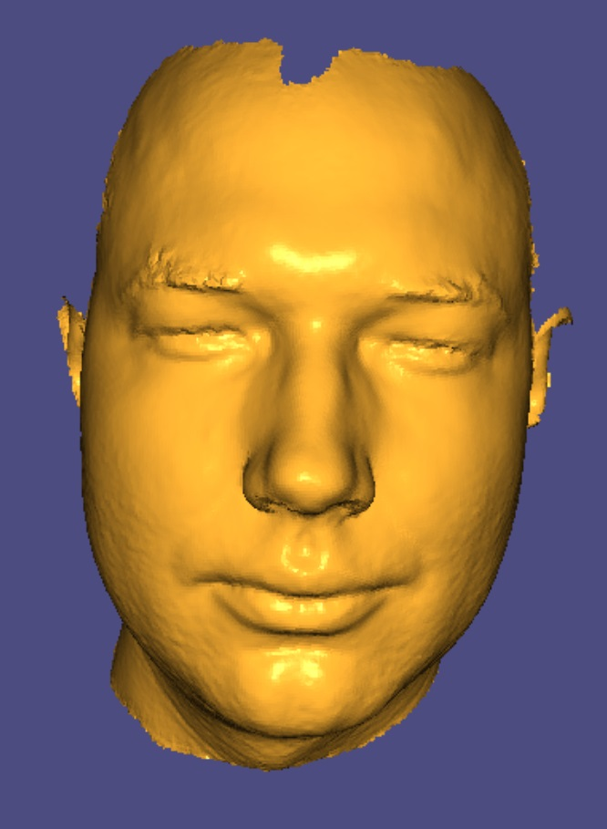
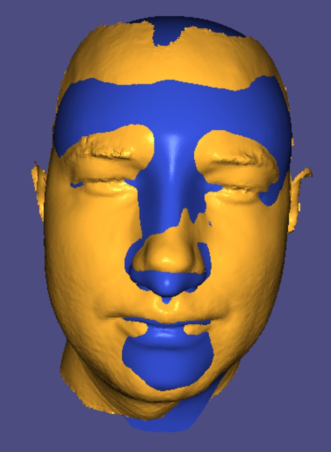

# smgp-3D-face-modeling-and-learning

## Rigid Alignment

### Method

We use the Kabsch algorithm (based on SVD) to calculate the rotation of the rigid alignment. This minimizes the RMSD of the face landmarks to the template landmarks.

### Compiling

```
mkdir build; cd build
cmake -DCMAKE_BUILD_TYPE=Release ../
make
```
Or use your favorite IDE with Cmake plugins.

### Test code

Running with no arguments runs the code on the provided test mesh and shows a visualization
```
./assignment6_rigid
```

Press:
- `1` to see original template
- `2` to see original head
- `3` to see output template
- `4` to see output head
- `5` to see output template + head

| Scaled template| Rigidly aligned face| Both superimposed |
|:-------------------------:|:-------------------------:|:-------------------------:|
 |  |  |

### Apply to folders

Running with two arguments runs the code on the provided test mesh.

Example:
```
./assignment6_rigid  ../data/folder_in/ ../data/folder_out/
```

First argument is the folder with the input meshes with `.obj` meshes and `.txt` landmark files.
There should be the same ammount of `.obj` and `.txt` files in the folder. They are then matched alphabetically.

Second argument is output folder.

The code assumes the landmarks are indexed from 0 and that they are 22 of them (indexed 0-21).
The folders should already exist.


