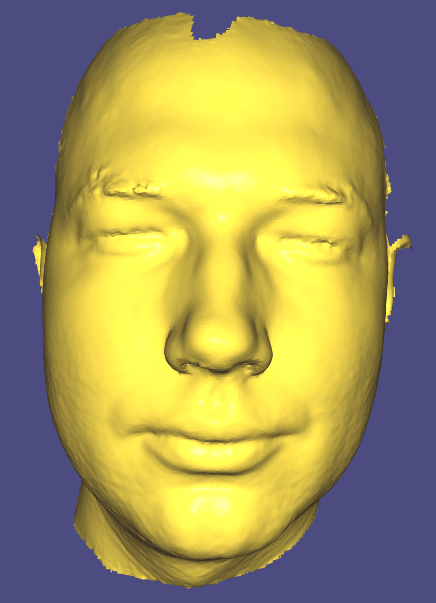
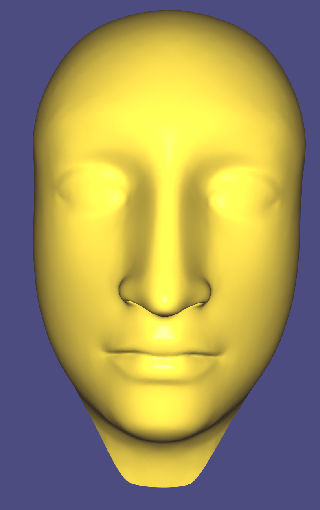
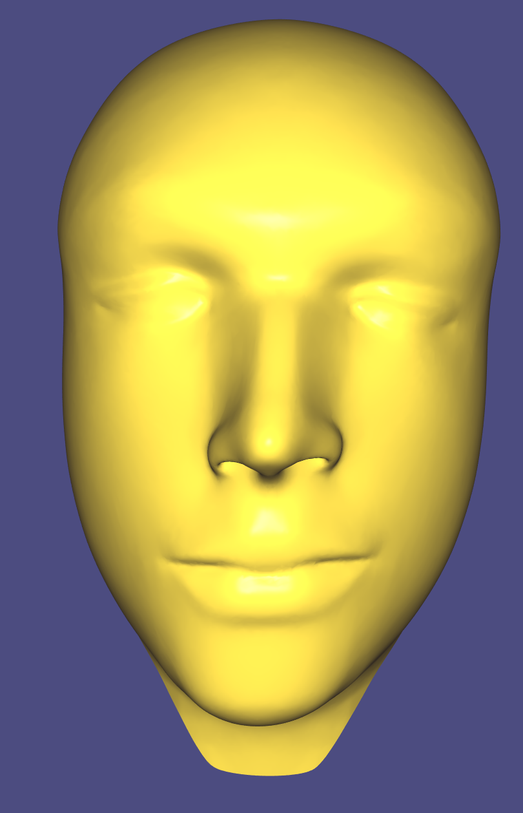
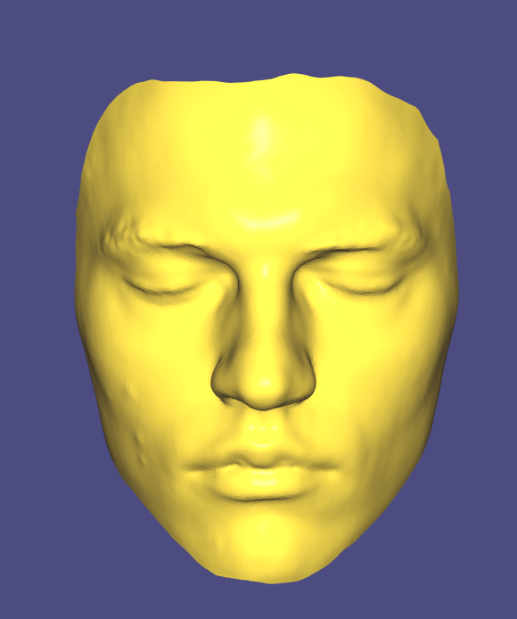
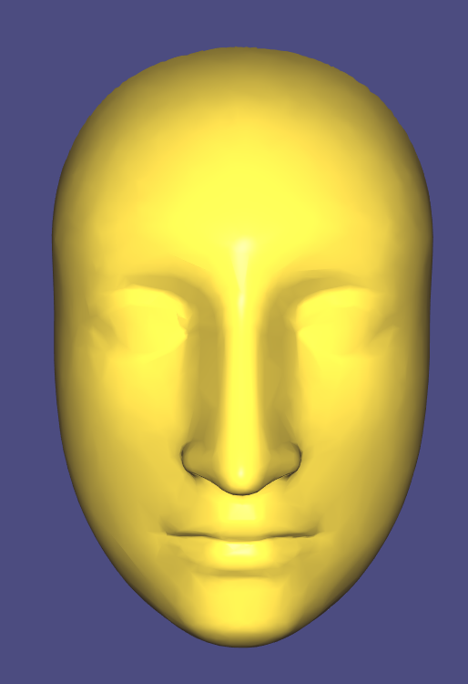
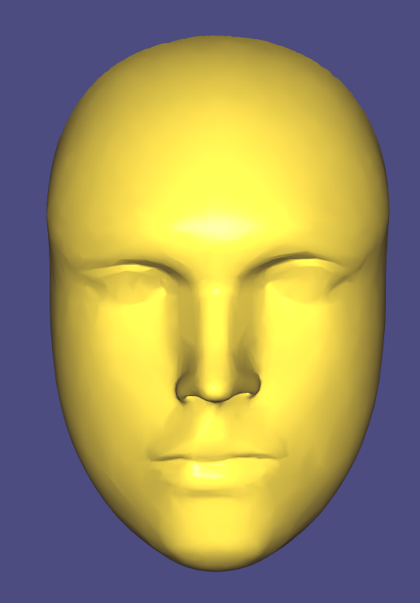
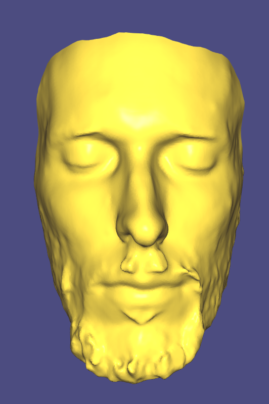
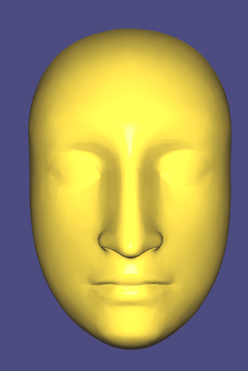
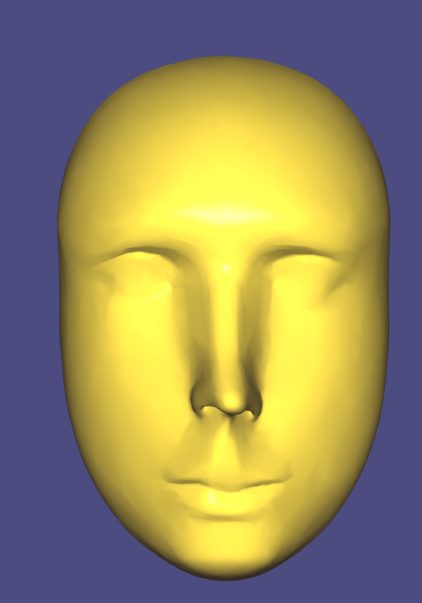

# Warping

## Results
We solve suggested equation from assigment slides.  

Screenshots:\
First: Target scan\
Second: Template\
Third: Warped template

#### Person0

#### Gleb neutral

#### Jan neutral

